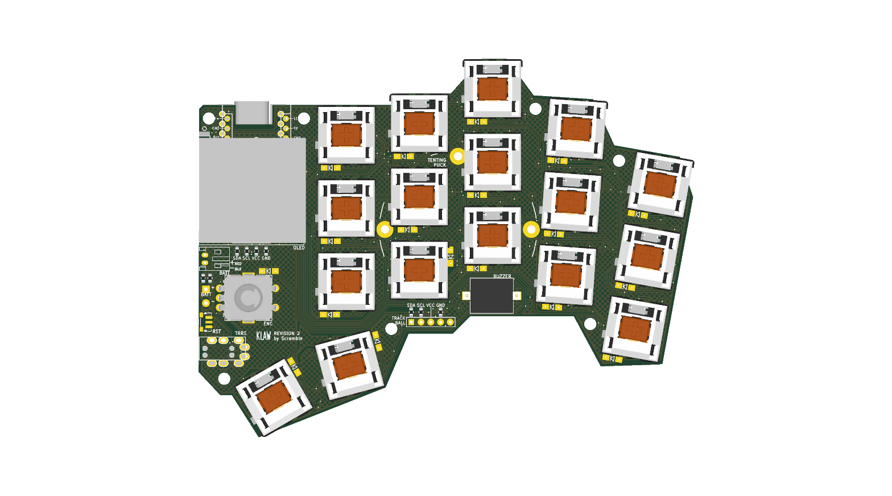

# KLAW — 34-key reversible split keyboard

KLAW is a compact **34-key column-staggered split keyboard**, derived from
[GEIGEIGEIST's KLOR](https://github.com/GEIGEIGEIST/KLOR). Its trick: **one
reversible PCB serves both halves** — populate the front face and it's the right
half, populate the back face and it's the left. One board design, one fab order,
both hands.

## Features

- **34 keys** (17 per half), column-staggered, MX-style switches
- **Hot-swap sockets** (Kailh CPG151101S11-compatible) — no switch soldering
- **Per-key RGB** — SK6812MINI-EA LEDs, reverse-mounted to glow through the board (machine-assemblable)
- **Wired or wireless** — TRRS between halves, or Bluetooth with a
  nice!nano-compatible controller (socketed, Pro Micro pinout); battery connector
  and power switch on board
- **Rotary encoder** (EC11) per half — volume knob or anything you map to it
- **0.96″ SSD1306 OLED** per half
- **Piezo buzzer**, reset button, and optional
  [splitkb tenting puck](https://splitkb.com/products/tenting-puck) mounting
- Optional trackball level-converter header (unpopulated by default)

## Repository layout

| Path | Contents |
|---|---|
| `pcb/klaw_1/` | KiCad 10 project — schematic, board, project library with LCSC sourcing fields and 3D models |
| `fab/` | JLCPCB production files — gerbers, drills, BOM, placement (see `fab/README.md`) |
| `bom/` | Per-half build BOMs (`bom_left.csv`, `bom_right.csv`) with LCSC part numbers |
| `case/` | Case design (in progress) |
| `code/` | Firmware config (in progress) |

## Building one

**1. Order the PCBs.** Both halves use the **same board** — upload
`fab/klaw_1-gerbers.zip` to [JLCPCB](https://jlcpcb.com) (2-layer, 1.6 mm). For
machine assembly place **two orders with the same gerbers**: the right half
assembles on the **Top** side (`fab/right-half/`), the left half assembles the
same parts on the **Bottom** side (`fab/left-half/`). Each covers the diodes,
encoder, buzzer, TRRS jack, battery connector, and both small switches — see
`fab/README.md` for the exact flow and a placement-review checklist.

**2. Hand-solder the hot-swap sockets** (LCSC `C41430893`) — the one remaining
hand-solder job. The per-key RGB LEDs (SK6812MINI-EA, LCSC `C5378731`) are
factory-reversed parts that JLCPCB machine-assembles along with everything else.
Exact part numbers, prices, and per-half quantities are in `bom/`.

**3. Add your own** MX-style switches (hot-swap, no soldering), a
nice!nano-compatible controller (socket it — the MCU mounts on the **bottom**,
components facing the PCB, as marked on the silkscreen), a 4-pin I²C SSD1306
OLED module, keycaps, and for wireless use a 301230-or-similar LiPo battery
(JST PH connector or solder pads).

**4. Firmware.** ZMK (wireless) or QMK (wired) configs for the KLOR family are a
good starting point; a KLAW-specific config will land in `code/`.

The KiCad project embeds datasheet links, LCSC part numbers, and last-checked
stock/pricing on every schematic symbol, so `kicad-cli sch export bom` always
gives you a current shopping list.

## Credits & license

KLAW is a derivative of the [KLOR](https://github.com/GEIGEIGEIST/KLOR) keyboard
by GEIGEIGEIST — the layout, reversible-footprint approach, and much of the PCB
heritage come from that project. Licensed under **GPL-3.0**, same as KLOR; see
`LICENSE.md`.
