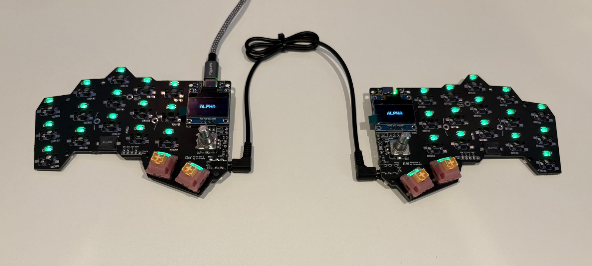
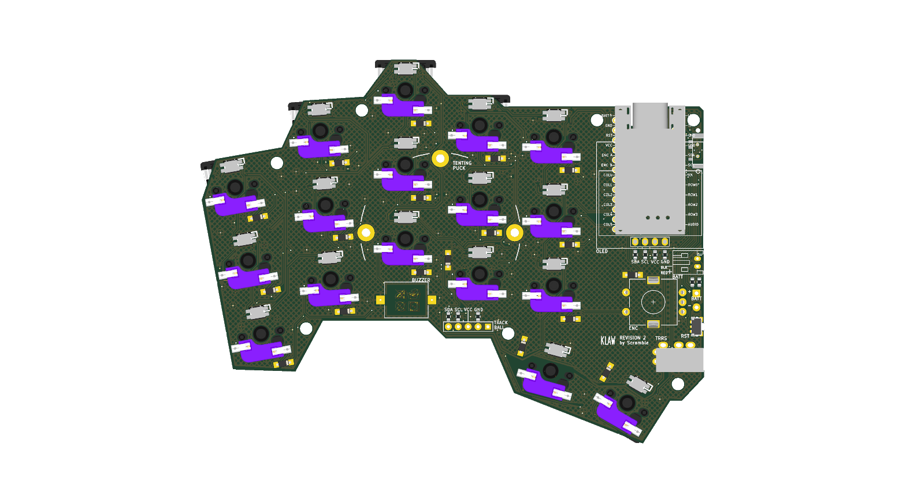

# KLAW - 34-key reversible split keyboard

KLAW is a compact **34-key split keyboard with LEDs, OLED, buzzer and
encoder**. It is designed as one reversible PCB that serves both halves -
components on the back face make the right half, components on the front face
make the left half. One board design: the same gerber files can be used for
both halves, with separate BOM and CPL files per half. Every component can be
machine-assembled, but you may want to hand-assemble the MCU and OLED modules.
The latest revision is rev 2.

Below are renders of the right half:

## Features

- **34 keys** (17 per half), column-staggered, MX-style switches
- **Hot-swap sockets** (Kailh CPG151101S11-compatible) - no switch soldering
- **Per-key RGB** - SK6812MINI-EA LEDs, reverse-mounted to glow through the board (machine-assemblable)
- **Wired or wireless** - TRRS between halves, or Bluetooth with a
  nice!nano-compatible controller (socketed, Pro Micro pinout); battery
  connector and power switch on board (unpopulated in the wired-first default)
- **Rotary encoder** (EC11) per half - volume knob or anything you map to it
- **0.96″ SSD1306 OLED** per half
- **Piezo buzzer**, reset button, and optional
  [splitkb tenting puck](https://splitkb.com/products/tenting-puck) mounting
- **Optional trackball** level-converter header (unpopulated by default)
- **Configuration by placement** - the OLED mapping, trackball routing, and
  battery-polarity links are 0603 0R resistors, placed per side by the
  assembly service; nothing to bridge by hand

## Repository layout

| Path | Contents |
|---|---|
| `pcb/klaw_2/` | KiCad 10 project - schematic, board, project library with LCSC sourcing fields and 3D models |
| `fab/` | JLCPCB production files - gerbers, drills, BOM, placement (see `fab/README.md`) |
| `bom/` | Per-half build BOMs (`bom_left.csv`, `bom_right.csv`) with LCSC part numbers |
| - | Firmware (QMK/Vial) lives in [scrambletools/klaw-firmware](https://github.com/scrambletools/klaw-firmware) |

The case is designed in Plasticity and maintained outside this repository.

## Building one

**1. Order the PCBs.** Both halves use the **same board** - upload
`fab/klaw_2-gerbers.zip` to [JLCPCB](https://jlcpcb.com) (2-layer, 1.6 mm). For
machine assembly place **two orders with the same gerbers**: the right half
assembles on the **Bottom** side (`fab/right-half/`), the left half on the
**Top** side (`fab/left-half/`). Each order is double-sided and covers everything
solderable - see `fab/README.md` for the exact flow and placement-review checklist.

**2. No soldering required** - the assembly orders cover everything solderable:
diodes, factory-reversed per-key RGB LEDs (SK6812MINI-EA), hot-swap sockets,
TRRS, buzzer, reset switch, encoder, and each side's 0R configuration resistors
(double-sided assembly: the buzzer and encoder mount on the keycap face, every
other machine-placed part on the component face).
Mount-face tables, part numbers, prices, and per-half quantities are in `bom/`.

**3. Add your own** MX-style switches (hot-swap, no soldering), a
nice!nano-compatible controller (socket it - the MCU mounts on the **bottom**,
components facing the PCB, as marked on the silkscreen), a 4-pin I²C SSD1306
OLED module, and keycaps. For a wireless build, additionally fit the power
switch (`C431540`), JST battery connector (`C173752`), and a 301230-or-similar
LiPo - those three positions are DNP in the wired-first default, but their
polarity-selection resistors are already placed correctly per side.

**4. Firmware.** Flash the KLAW firmware (QMK/Vial) from
[scrambletools/klaw-firmware](https://github.com/scrambletools/klaw-firmware).

The KiCad project embeds datasheet links, LCSC part numbers, and last-checked
stock/pricing on every schematic symbol, so `kicad-cli sch export bom` always
gives you a current shopping list.

## Credits & license

KLAW is a derivative of the [KLOR](https://github.com/GEIGEIGEIST/KLOR)
keyboard by GEIGEIGEIST - the layout, reversible-footprint approach, and much
of the PCB heritage come from that project. Licensed under **GPL-3.0**, same
as KLOR; see `LICENSE.md`. The Cherry MX switch 3D model comes from the
[kiswitch keyswitch-kicad-library](https://github.com/kiswitch/keyswitch-kicad-library)
(MIT / CC-BY-SA 4.0); the nRF52840 SuperMini controller model comes from
[shnaps/garden36](https://github.com/shnaps/garden36) (MIT).
